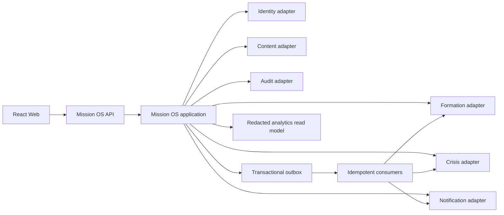

# Integration Map

```mermaid
flowchart LR
  Web["React Web"] --> API["Mission OS API"]
  API --> Mission["Mission OS application"]
  Mission --> Identity["Identity adapter"]
  Mission --> Formation["Formation adapter"]
  Mission --> Crisis["Crisis adapter"]
  Mission --> Content["Content adapter"]
  Mission --> Notify["Notification adapter"]
  Mission --> Audit["Audit adapter"]
  Mission --> Outbox["Transactional outbox"]
  Outbox --> Consumers["Idempotent consumers"]
  Consumers --> Formation
  Consumers --> Crisis
  Consumers --> Notify
  Mission --> ReadModel["Redacted analytics read model"]
```

Direct cross-context table writes are forbidden. Notification failure is asynchronous. Crisis escalation is human-owned. Analytics cannot mutate Mission OS aggregates.
